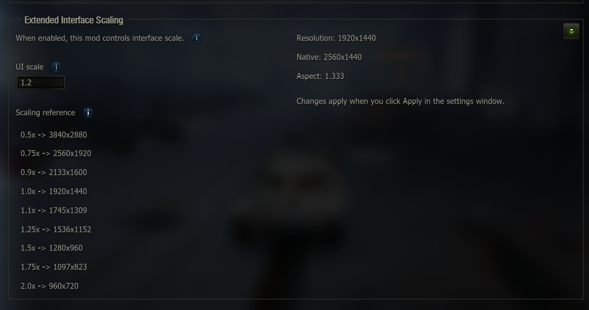

# Extended Interface Scaling



A World of Tanks PC mod for precision UI scaling.

[Wargaming Mod Portal](https://wgmods.net/6803/)

## Overview

Extended Interface Scaling v2 applies custom interface scaling so you can tune the UI size to exactly what you want.

Use the garage UI to pick a scale for your resolution, or edit the JSON config file directly.

### Players

- World of Tanks PC (EU WG or Lesta)
- Required for the garage settings UI:
  - [ModsList](https://gitlab.com/wot-public-mods/mods-list/)
  - [ModsSettings API](https://github.com/izeberg/modssettingsapi) (mod configuration menu)
  - [OpenWG Gameface](https://gitlab.com/openwg/wot.gameface/) (required by ModsList)

Without ModsList/ModsSettings, the mod still works using the JSON config.

## Installation

1. Install **Gameface**, **ModsList**, and **ModsSettings API** `.wotmod` files into `World_of_Tanks/mods/<game_version>/`
   - Load order: Gameface → ModsList → ModsSettings API → Extended Interface Scaling
2. Install this mod’s `.wotmod` in the same folder
3. Launch the game
4. Open **Mods** in the garage → **Mod configurator**

## Usage

When the mod is **enabled**, it overrides the in-game **Options → Graphics → Interface Scaling** setting. Configure via the mod configuration page instead.

### JSON fallback

If ModsList/ModsSettings are not installed, edit the JSON config file directly:

`World_of_Tanks/mods/<game_version>/configs/ANIALLATOR.extended_interface_scaling/config.json`

```json
{
  "scale": 1.25,
  "enabled": true
}
```

Restart the game to reload settings if ModsSettings is not installed.

## Development

- Python 2.7.18 ([download page](https://www.python.org/downloads/release/python-2718/))
- On Windows: use the **x86-64 MSI** (`python-2.7.18.amd64.msi`) unless you specifically need 32-bit

### Setup

Install [Python 2.7.18](https://www.python.org/downloads/release/python-2718/) from python.org. The default install path on Windows is usually `C:\Python27\`.

Verify the install:

```bash
# CMD or PowerShell
C:\Python27\python.exe --version   # should print Python 2.7.18

# Git Bash — use forward slashes (backslashes are escape characters in bash)
/c/Python27/python.exe --version
```

If the Windows **py launcher** registered 2.7 during install, `py -2.7 --version` also works in any shell.

### Build

```bash
# CMD or PowerShell
C:\Python27\python.exe build.py --username ANIALLATOR --version 2.0.0

# Git Bash
/c/Python27/python.exe build.py --username ANIALLATOR --version 2.0.0
```

If the py launcher knows about 2.7: `py -2.7 build.py --username ANIALLATOR --version 2.0.0`

Output: `build/ANIALLATOR.Extended_Interface_Scaling_2.0.0.wotmod`

### CI / Releases

GitHub Actions builds the mod on every pull request and on merges to `master`.

- **Pull requests** — download the `.wotmod` from the workflow run’s **Artifacts** (`wotmod-pr-{commit_sha}`).
- **Merges to `master`** — publishes or updates a [GitHub Release](https://github.com/ANIALLATOR114/extended-interface-scaling/releases) (`v{version}`) with the built `.wotmod` attached.

### Decompiled reference

See [docs/DECOMPILED_REFERENCE.md](docs/DECOMPILED_REFERENCE.md). Primary EU reference branch: [StranikS-Scan/WorldOfTanks-Decompiled `2.2.1.1_EU`](https://github.com/StranikS-Scan/WorldOfTanks-Decompiled/tree/2.2.1.1_EU).

## Credits

- [StranikS-Scan / WorldOfTanks-Decompiled](https://github.com/StranikS-Scan/WorldOfTanks-Decompiled) — decompiled game sources
- [ModsSettings API](https://github.com/izeberg/modssettingsapi) — mod configuration menu
- [ModsList](https://gitlab.com/wot-public-mods/mods-list) — garage mod menu
- [LockBlock-dev](https://github.com/LockBlock-dev/wot-mods/tree/master/auto-packer) — original packer script
